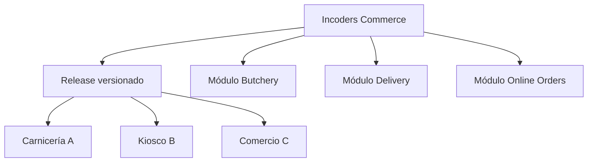
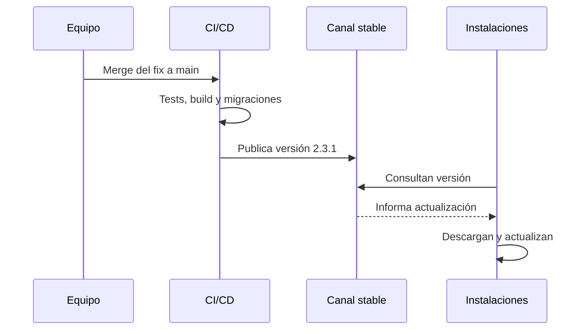

# Incoders Commerce — Estrategia de módulos, clientes y releases

**Estado:** decisión arquitectónica propuesta  
**Ámbito:** repositorios, variantes de producto, personalizaciones y distribución  
**Documento destino en el repositorio:** `docs/architecture/product-variants-and-release-strategy.md`

---

## 1. Decisión resumida

Incoders Commerce se mantendrá como una única plataforma:

- Un repositorio principal.
- Una rama principal.
- Un núcleo común.
- Un monolito modular.
- Releases globales y versionadas.
- Módulos habilitables por organización.
- Configuración para diferencias operativas.
- Feature flags para despliegues graduales.
- Permisos para controlar qué puede hacer cada usuario.
- Extensiones específicas solamente cuando no alcance la configuración.
- Sin ramas ni repositorios permanentes por cliente.

Una corrección común se implementa una vez y se distribuye a todos los clientes. Una funcionalidad particular, como reparto o romaneo, puede viajar en el mismo release pero permanecer deshabilitada para organizaciones que no la utilizan.

## 2. Motivo

Crear un repositorio, una rama o una variante completa por cliente genera divergencia:

- La misma corrección debe repetirse.
- Aparecen cherry-picks y conflictos.
- Cada cliente queda en una versión diferente.
- Las migraciones dejan de ser uniformes.
- Aumentan las combinaciones que deben probarse.
- Resulta difícil reproducir errores.
- Se vuelve costoso actualizar y brindar soporte.

La variación debe resolverse mediante límites explícitos dentro de una sola plataforma.

## 3. Estructura general



Todos reciben una versión compatible del núcleo. Cada organización utiliza solamente las capacidades contratadas y habilitadas.

## 4. Repositorios

### 4.1 Repositorio principal

Nombre recomendado:

```text
incoders-commerce
```

Estructura conceptual:

```text
incoders-commerce/
├── apps/
│   ├── pos/
│   ├── admin-web/
│   ├── online-orders/
│   ├── local-node/
│   └── cloud-api/
├── modules/
│   ├── identity/
│   ├── organizations/
│   ├── customers/
│   ├── catalog/
│   ├── pricing/
│   ├── sales/
│   ├── orders/
│   ├── payments/
│   ├── cash-management/
│   ├── inventory/
│   ├── purchasing/
│   ├── finance/
│   ├── delivery/
│   ├── campaigns/
│   └── butchery/
├── integrations/
│   ├── payments/
│   ├── invoicing/
│   ├── scales/
│   ├── printers/
│   └── notifications/
├── extensions/
└── docs/
```

La estructura definitiva dependerá del stack, pero los límites conceptuales deben conservarse.

### 4.2 Producto independiente de romaneo automático

La aplicación de imágenes, videos y machine learning tendrá un repositorio independiente:

```text
incoders-romaneo
```

La separación se justifica porque tendrá:

- Ciclo de vida propio.
- Procesamiento multimedia.
- Modelos de machine learning.
- Despliegue y hardware diferentes.
- Comercialización independiente.
- Contrato de integración con Incoders Commerce.

## 5. Niveles de variación

### 5.1 Núcleo común

Capacidades utilizadas por prácticamente todos los clientes:

- Organizaciones y sucursales.
- Usuarios y seguridad.
- Clientes.
- Productos.
- Ventas.
- Caja.
- Auditoría.
- Sincronización.
- Instalación y actualización.

Los bugs del núcleo se corrigen una vez y se distribuyen mediante un release global.

### 5.2 Módulos habilitables

Capacidades que pertenecen al producto pero no todos necesitan:

- Reparto.
- Pedidos online.
- Campañas.
- Romaneo.
- Compras.
- Cuentas corrientes.
- Empleados.

Ejemplo conceptual:

```text
delivery.enabled = true
butchery.enabled = true
online_orders.enabled = true
campaigns.enabled = false
```

Cuando un módulo está deshabilitado:

- No aparece en navegación.
- Sus endpoints rechazan el acceso.
- No ejecuta trabajos de fondo.
- No exige configuración.
- No emite notificaciones.
- Sus permisos no quedan disponibles para asignación común.

La validación debe ocurrir en backend y no solamente ocultando botones.

### 5.3 Configuración por organización

La configuración determina cómo se comporta un módulo habilitado:

```text
delivery.require_remittance = true
delivery.allow_partial_delivery = true
delivery.priority_paid_online = true
inventory.allow_negative_stock = false
pricing.default_price_list = retail
```

Se utiliza para políticas, formatos y reglas conocidas. No debe usarse para introducir código arbitrario por cliente.

### 5.4 Feature flags

Una feature flag controla el despliegue de una implementación, no lo que compró el cliente.

Ejemplos:

- Activar gradualmente un nuevo optimizador de rutas.
- Habilitar una pantalla nueva en una organización piloto.
- Desactivar rápidamente una función defectuosa.
- Comparar dos implementaciones durante una migración.

Las flags deben tener propietario, fecha de creación, propósito y condición de retiro. No deben convertirse en configuración permanente sin decisión explícita.

### 5.5 Extensiones específicas

Una necesidad exclusiva seguirá este orden:

1. Configuración.
2. Regla parametrizable.
3. Plantilla.
4. Capacidad reutilizable dentro de un módulo.
5. Adaptador o plugin mediante contrato público.
6. Fork independiente solamente como último recurso.

Ejemplo:

```text
extensions/
└── customer-butcher-a/
    ├── reports/
    ├── templates/
    └── configuration/
```

Regla de dependencia:

> La extensión puede depender del núcleo; el núcleo nunca debe depender de una extensión de cliente.

## 6. Separación de conceptos

| Concepto | Pregunta que responde | Ejemplo |
|---|---|---|
| Módulo | ¿Qué dominio funcional existe? | Delivery |
| Plan o licencia | ¿Qué compró la organización? | Commerce Distribution |
| Capability | ¿Qué puede usar esta organización? | delivery.enabled |
| Configuración | ¿Cómo debe comportarse? | allow_partial_delivery |
| Feature flag | ¿Qué implementación se libera y a quién? | route_optimizer_v2 |
| Permiso | ¿Qué usuario puede ejecutar la acción? | delivery.route.manage |
| Canal de release | ¿Qué grado de estabilidad recibe? | pilot |

Ejemplo completo:

```text
Module: Delivery
Plan: Commerce Distribution
Capability: delivery.enabled
Feature flag: delivery.route_optimizer.v2
Configuration: delivery.allow_partial = true
Permission: delivery.route.manage
Release channel: pilot
```

## 7. Caso: corrección común

Supuesto: existe un bug en el alta de clientes.



Resultado:

1. El módulo Customers se corrige una vez.
2. Las pruebas comunes y de módulos se ejecutan.
3. Se crea un release.
4. Las instalaciones detectan la versión.
5. Se despliega progresivamente.
6. No se modifican repositorios individuales.

El rollout recomendado es:

1. Internal.
2. Terminal o ambiente piloto.
3. Primera sucursal.
4. Segunda sucursal.
5. Otras organizaciones.

Un hotfix crítico puede acelerar el rollout, pero debe conservar firma, pruebas, health checks y recuperación.

## 8. Caso: cambio exclusivo de reparto

Supuesto: la carnicería necesita una mejora en entregas parciales.

Si la capacidad puede servir a otros distribuidores:

- Se implementa dentro de Delivery.
- Se protege inicialmente con una feature flag.
- Se habilita para la carnicería piloto.
- El kiosco recibe el release, pero Delivery permanece deshabilitado.
- Luego puede ofrecerse a otros clientes.

Ejemplo:

```text
delivery.enabled = true
delivery.partial_delivery.enabled = true
```

En el kiosco:

```text
delivery.enabled = false
```

Si el cambio es únicamente un formato de remito:

```text
delivery.remittance.template = butcher-a-v2
```

No corresponde crear una rama permanente de la carnicería.

## 9. Paquetes y distribución

### Etapa inicial

El monolito modular puede distribuir todos los módulos en el mismo paquete. Las capabilities deciden cuáles se activan.

Ventajas:

- Un solo instalador.
- Menor complejidad operativa.
- Una versión global.
- Correcciones más fáciles.
- Diagnóstico uniforme.

### Evolución

Si el tamaño o la comercialización lo requieren, podrán generarse ediciones:

```text
Commerce Retail
Commerce Distribution
Commerce Butchery
```

Todas se construirán desde el mismo repositorio y el mismo núcleo. No serán forks por cliente.

## 10. Versionado

Versión global:

```text
Incoders Commerce 2.3.1
```

Contratos técnicos versionables cuando corresponda:

```text
Platform: 2.3.1
Delivery contract: 2
Sync protocol: 3
Database schema: 47
Butchery module: 1.4
```

No es necesario publicar cada módulo de manera independiente desde el inicio. Sí deben versionarse los contratos que puedan convivir entre instalaciones, cloud y nodos locales.

## 11. Flujo Git y release

- Una rama main protegida.
- Ramas de trabajo de corta duración.
- Pull requests con pruebas obligatorias.
- Sin branches permanentes por organización.
- Tags para versiones liberadas.
- Artefactos firmados e inmutables.
- Canales internal, pilot y stable.
- Rollout progresivo.
- Registro de versión por instalación.

Main representa código integrado y potencialmente liberable. Un merge puede generar automáticamente una versión candidata, pero no debe instalarse inmediatamente en todos los clientes sin pasar por el canal correspondiente.

## 12. Estrategia de pruebas

El pipeline deberá cubrir:

- Tests del núcleo.
- Tests de cada módulo.
- Tests de permisos y capabilities.
- Tests con módulos activados y desactivados.
- Compatibilidad de contratos.
- Migraciones desde versiones soportadas.
- Sincronización entre versiones compatibles.
- Instalación, upgrade y recuperación.
- Una matriz limitada de configuraciones representativas.

No se intentará probar toda combinación posible de flags. Se definirán perfiles soportados, por ejemplo Retail, Distribution y Butchery.

## 13. Reglas para los agentes

Antes de implementar una diferencia solicitada por un cliente, determinar:

1. ¿Es una corrección del núcleo?
2. ¿Pertenece a un módulo existente?
3. ¿Puede resolverse por configuración?
4. ¿Debe ser una capability comercial?
5. ¿Necesita una feature flag temporal?
6. ¿Es reutilizable por otras organizaciones?
7. ¿Requiere una extensión?

Los agentes no deberán:

- Crear ramas permanentes por cliente.
- Duplicar módulos para cambiar una regla.
- Validar capabilities solamente en frontend.
- Introducir condicionales por nombre o ID de cliente en el núcleo.
- Crear una configuración sin tipado, validación y valor predeterminado.
- Dejar feature flags temporales indefinidamente.
- Romper compatibilidad de sincronización sin versionar el contrato.

## 14. Decisiones derivadas

Esta estrategia implica crear posteriormente:

- Catálogo de módulos.
- Catálogo de capabilities.
- Modelo de licenciamiento.
- Servicio de configuración por organización.
- Sistema de feature flags.
- Matriz de permisos.
- Contratos públicos para extensiones.
- Perfiles de prueba representativos.
- Política de compatibilidad.
- Estrategia de versionado y migraciones.

## 15. Excepciones

Un repositorio o despliegue dedicado podrá evaluarse si existe:

- Obligación contractual o regulatoria.
- Requisito fuerte de aislamiento físico.
- Ciclo de release incompatible.
- Producto técnicamente independiente.
- Integración propietaria imposible de distribuir.
- Personalización cuyo mantenimiento esté contratado y justificado.

La excepción deberá documentarse mediante ADR. No debe surgir simplemente porque un cliente pidió una pantalla diferente.

## 16. Decisión final

> Incoders Commerce será una plataforma única, modular y configurable. Las correcciones comunes se distribuirán mediante releases globales; las funciones particulares se aislarán mediante módulos, capabilities, configuración, feature flags o extensiones. No se mantendrán forks, repositorios ni ramas permanentes por cliente salvo excepción arquitectónica documentada.

## 17. Ubicación y lecturas relacionadas

Ubicación recomendada:

```text
docs/architecture/product-variants-and-release-strategy.md
```

Debe enlazarse desde:

- README principal.
- Índice de documentación.
- SDD de arquitectura.
- Guía de contribución para agentes.

Lecturas previas recomendadas:

1. README.md
2. docs/product/PRD.md
3. Este documento.

Documentos siguientes:

1. ADR: monorepo y monolito modular.
2. Especificación de módulos y capabilities.
3. Estrategia de feature flags.
4. SDD de actualización y releases.
5. SDD de sincronización local/cloud.
