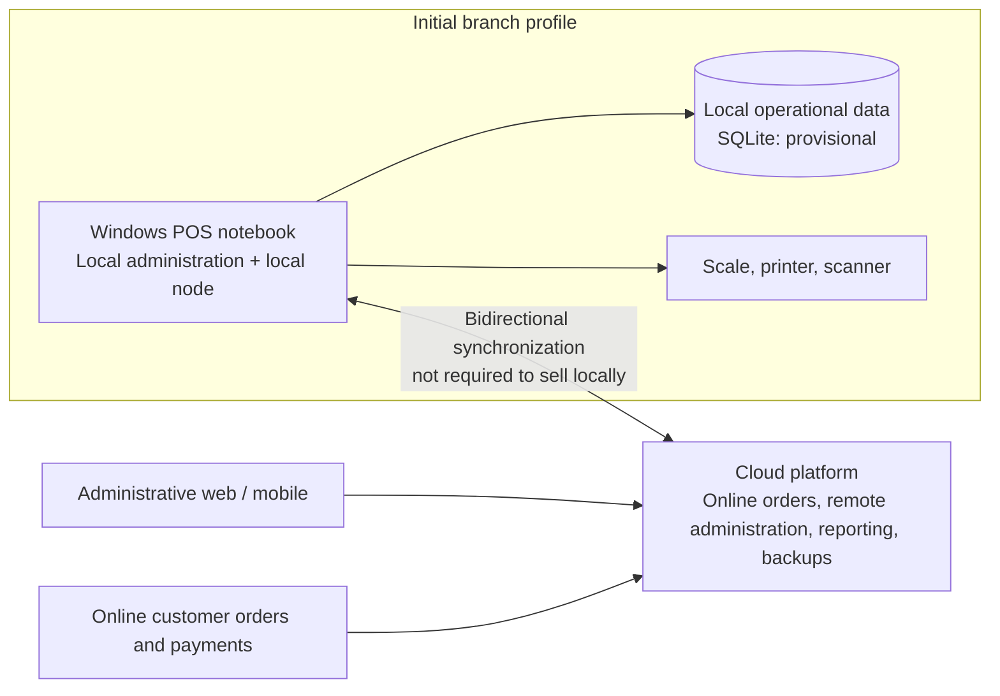

# Incoders Commerce

Offline-first commerce platform for retail stores: POS, inventory, orders, delivery, and business management.

**Initial vertical:** butcher shops and meat distribution. The reusable core is designed for retail, wholesale, and distribution operations.

## Non-negotiable guarantees

- Local sales, POS, and direct peripheral operations continue without Internet.
- Each branch owns a logical local node; cloud synchronization never blocks a local sale.
- Operations are traceable, idempotent, and retained until cloud confirmation.
- Product, stock, cash, orders, and payments remain related by explicit movements and audit records.

## Initial branch profile

Each branch initially uses one Windows POS notebook. It physically co-locates the POS, local administration, and local node, but does not remove the node boundary: the product can evolve to multiple terminals connected to the same branch node.

Notebook replacement is a coordinated identity, data, and peripheral operation—not an application update. See the [deployment profile](./docs/architecture/deployment-profiles.md).

## Architecture at a glance

Editable source: [architecture overview (.drawio)](./diagrams/incoders-commerce-architecture-overview.drawio). The [scalable LAN diagram](./diagrams/incoders-commerce-local-branch-lan.drawio) describes the future multi-station topology.

## Documentation map

| Need | Source of truth |
|---|---|
| Product scope, roles, flows, and requirements | [PRD](./PRD.md) |
| Reusable product-domain vocabulary and vertical boundaries | [Product domain](./docs/domain/product-domain.md) |
| Architecture index and confirmed/provisional/pending status | [Architecture documentation](./docs/architecture/README.md) |
| Initial notebook profile and replacement | [Deployment profiles](./docs/architecture/deployment-profiles.md) |
| Synchronization principles and authority | [Synchronization](./docs/architecture/synchronization.md) |
| Product variants and release strategy | [Product variants](./PRODUCT_VARIANTS_AND_RELEASE_STRATEGY.md) |
| UI product definitions | [UI product definitions](./UI_PRODUCT_DEFINITIONS.md) |

## Branch model

- `dev`: active integration branch and current documentation publication target.
- `staging`: reserved for future validation.
- `main`: reserved for promoted production-ready content.

No pull request or promotion is implied by publishing to `dev`.

## Wiki

The [Wiki](https://github.com/Incoders-Tools/incoders-commerce/wiki) is reserved for processes, onboarding, and navigation. Product and architecture documentation are versioned in this repository.

## Status

The project is in product definition. Technology choices remain open and must be decided through evidence and ADRs, not inferred from this README.
